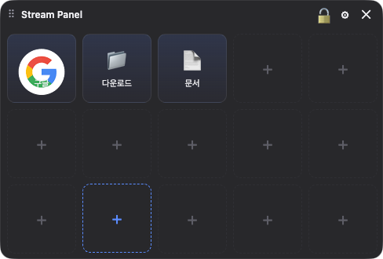
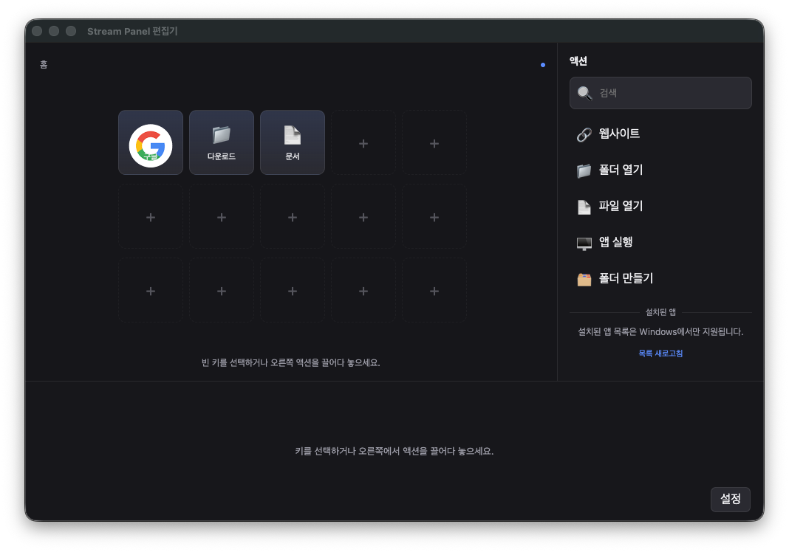
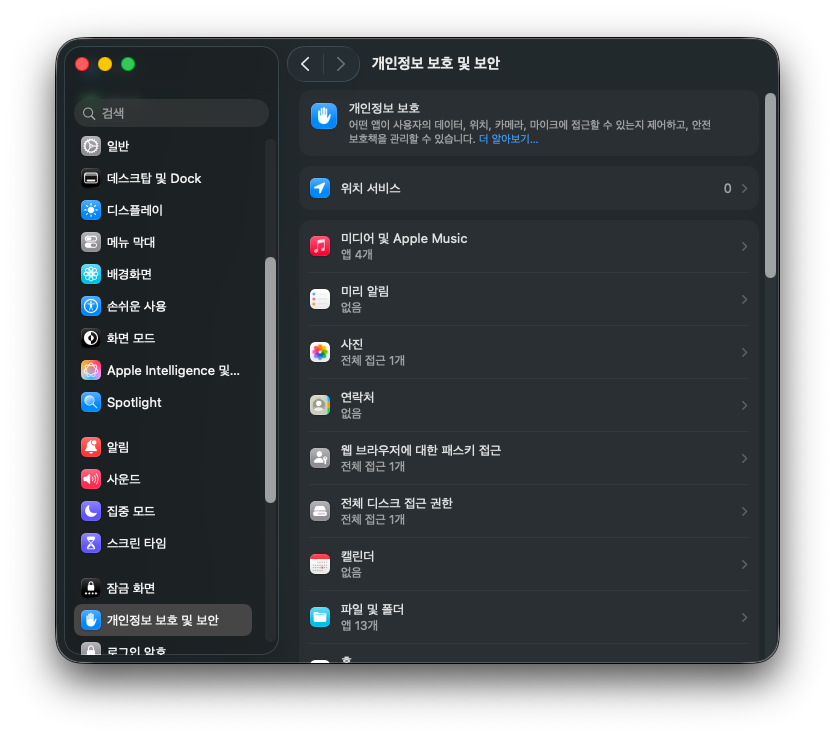

# Stream Panel

Stream Panel은 윈도우와 맥 바탕화면에서 쓰는 소프트웨어 실행 패널입니다. 별도 장치 없이 스트림덱의 키와 편집기 흐름을 재현하며, 웹사이트, 폴더, 파일과 설치된 앱을 키로 등록해 바로 실행할 수 있습니다.

개발자: 청계초등학교 교사 조영석

## 화면

### 패널



### 편집기



## 설치

### 윈도우

1. [릴리즈 페이지](https://github.com/deepsky616/stream-panel/releases)에서 `StreamPanel-x.y.z-Setup.exe`를 내려받습니다.
2. 설치 파일을 실행하고 설치할 폴더를 선택합니다.
3. 설치가 끝나면 Stream Panel이 자동으로 실행됩니다.

처음 실행할 때 **윈도우에서 피시를 보호했습니다** 화면이 나올 수 있습니다. `추가 정보`를 누른 뒤 `실행`을 선택하세요. 코드 서명 인증서를 구매하지 않은 공개 소스 앱이라 나타나는 정상적인 경고입니다. 설치 파일은 이 저장소의 공개된 소스에서 깃허브 자동 작업으로 직접 만듭니다.

### 맥

1. [릴리즈 페이지](https://github.com/deepsky616/stream-panel/releases)에서 맥의 칩에 맞는 파일을 받습니다.
   - 애플 실리콘 칩은 `StreamPanel-x.y.z-arm64.dmg`
   - 인텔 칩은 `StreamPanel-x.y.z-x64.dmg`
   - 칩 종류는 애플 메뉴의 `이 맥에 관하여`에서 확인할 수 있습니다.
2. 디스크 이미지를 열고 Stream Panel을 `Applications` 폴더로 끌어다 놓습니다.
3. 응용 프로그램 폴더에서 Stream Panel을 엽니다.

#### 처음 한 번 맥 보안 허용하기

코드 서명 인증서가 없는 공개 소스 앱이라 처음 실행할 때 개발자를 확인할 수 없다는 안내가 나옵니다. 다음 순서로 한 번만 허용하면 이후에는 바로 열립니다.

1. 첫 실행 안내에서 `완료`를 누릅니다.
2. `시스템 설정`의 `개인정보 보호 및 보안`으로 갑니다.
3. 오른쪽 목록을 맨 아래까지 내린 뒤 Stream Panel 차단 안내에서 `그대로 열기`를 누릅니다.
4. 확인 창에서 다시 `그대로 열기`를 누릅니다.



맥에서는 코드 서명이 필요한 자동 업데이트를 지원하지 않습니다. 새 버전 알림이 뜨면 메뉴 막대의 `릴리즈 페이지 열기`에서 새 디스크 이미지를 직접 받아 설치해 주세요. 앱은 Dock에 나타나지 않고 메뉴 막대에만 머뭅니다.

## 기본 사용법

1. 패널의 톱니바퀴 버튼이나 트레이 또는 메뉴 막대에서 편집기를 엽니다.
2. 오른쪽 액션 목록에서 웹사이트, 폴더, 파일, 앱 또는 멀티 액션을 왼쪽 빈 키로 끌어다 놓습니다.
3. 아래 속성 영역에서 이름, 아이콘, 색상과 실행 대상을 지정합니다. 변경 내용은 별도 저장 버튼 없이 바로 반영됩니다.
4. 폴더 키 위에 다른 키를 잠시 올리면 폴더가 열리며 관련 키를 안에 묶을 수 있습니다.
5. 작은 패널에서 키를 눌러 대상을 실행합니다.

파일 탐색기나 Finder에서 파일, 폴더와 맥 앱을 편집기 키로 바로 끌어다 놓을 수 있습니다. 브라우저 주소를 놓으면 웹사이트 키가 만들어지고, 이미지 파일을 기존 키 위에 놓으면 아이콘이 바뀝니다.

## 웹사이트를 원하는 브라우저로 열기

웹사이트 키를 선택하면 속성에서 설치된 브라우저를 지정할 수 있습니다. 지정하지 않으면 기존처럼 운영체제 기본 브라우저로 엽니다.

- 크로미움 계열 브라우저는 업무용이나 개인용 프로필을 고를 수 있습니다.
- `전용 창으로 열기`를 켜면 주소창과 탭이 없는 웹앱 창으로 열립니다.
- 파이어폭스와 사파리는 브라우저 지정만 지원하며 프로필과 전용 창은 지원하지 않습니다.
- 지정한 브라우저를 나중에 지워도 링크가 막히지 않습니다. 기본 브라우저로 대신 열고 원인을 안내합니다.
- 브라우저 실행 인자는 앱이 안전한 두 종류만 만듭니다. 사용자가 임의 실행 인자를 넣는 기능은 제공하지 않습니다.

## 나이스·에듀파인 웹 업무 연결 · 윈도우 전용

윈도우에서는 파워 오토메이트나 브라우저 확장 기능 없이 엣지나 크롬에서 정해진 업무 화면까지 이동할 수 있습니다. 스트림 패널이 직접 소유하는 업무용 브라우저 창과 교육청별 전용 프로필을 사용하므로 개인 브라우저의 탭, 방문 기록, 로그인 설정과 섞이지 않습니다.

맥에서는 나이스와 에듀파인 웹 업무 연결을 지원하지 않습니다. 웹 업무 액션과 연결 설정이 표시되지 않고 전용 브라우저도 시작하지 않습니다. 윈도우에서 만든 웹 업무 키를 맥에서 실행해도 개인 브라우저로 우회하지 않고 윈도우 전용 기능이라는 원인을 안내합니다.

기본으로 제공하는 웹 업무 키는 다음 네 가지입니다.

- 나이스 복무
- 나이스 출장
- 에듀파인 기안
- 에듀파인 품의

그 밖의 나이스와 에듀파인 화면은 설정의 `내 웹 업무 만들기`에서 직접 키로 만들 수 있습니다. 업무 이름, 교육청, 나이스 또는 에듀파인, 엣지 또는 크롬, 화면에서 누를 메뉴 이름과 마지막 도착 화면의 확인 문구를 입력합니다. 만든 키를 편집기에서 다시 선택하면 같은 화면에서 교육청과 이동 경로를 고쳐 저장할 수 있습니다. 메뉴 이동은 최대 여덟 단계이며 주소, 선택자, 스크립트나 키 입력은 받지 않습니다. 저장·제출·결재·등록·신청·확인·인증 입력 단계는 키에 넣을 수 있지만 실행할 때마다 해당 단계 직전에 사용자가 확인해야 합니다. 인증서와 암호는 읽거나 자동 입력하지 않습니다.

전국 17개 시도 교육청을 지원합니다. 기본 웹 업무 키를 패널에 놓은 뒤 속성에서 키마다 교육청을 선택할 수 있습니다. 설정에서 소속 교육청을 바꾸면 루트와 폴더 안에 있는 기본·사용자 지정 웹 업무 키의 교육청과 주소가 모두 동시에 바뀝니다. 키 식별자와 멀티 액션 참조는 그대로 유지됩니다.

나이스와 K-에듀파인 업무 키 자체는 업무포털 메뉴를 자동 클릭하지 않습니다. 다만 설정의 `업무용 브라우저 열기`를 명시적으로 누른 경우에는 업무포털 로그인을 기다린 뒤 이름이 정확히 일치하는 공식 나이스·K-에듀파인 연결 항목이 각각 하나일 때만 순서대로 실행하고, 항목이 없거나 모호하면 각 시스템 전용 탭으로 안전하게 대체합니다. 복무·출장·기안·품의 키를 누를 때는 시스템별 로그인 기준 탭 하나를 유지해 세션을 보존하고 이전 신청·작성 탭을 정리한 뒤 오른쪽 새 탭에서 처음부터 실행합니다. 업무 알림 확인은 기존 작업 탭을 바꾸지 않고 오른쪽 임시 탭에서 수행하며, 성공하면 임시 탭을 자동으로 닫고 로그인·인증·탐색 오류가 있을 때만 해당 탭을 남겨 앞으로 표시합니다. 최소화된 업무용 브라우저는 실행 전에 복원하며 같은 키를 연속으로 눌러도 작업은 하나만 실행됩니다.

메뉴와 화면 표식은 접근 가능한 `iframe`과 `frame`을 안쪽까지 재귀 탐색하고, 실제로 표시되고 활성화된 요소만 정확한 이름으로 선택합니다. 업무용 브라우저가 열려 있는 동안 15초마다 나이스·에듀파인 탭을 확인하고, `btnUseTimeExtn` 또는 세션 만료 문맥 안의 정확한 연장 버튼이 하나만 나타날 때 자동으로 연장합니다. 서버가 세션을 강제로 만료하거나 인증서·암호를 다시 요구하는 경우는 우회하지 않습니다.

기본 웹 업무의 고정 이동 경로는 다음과 같습니다.

- 나이스 복무·출장: 해당 관리 화면까지 이동한 뒤 `신청`을 눌러 새 신청 창까지 엽니다.
- 에듀파인 기안: `기안 → 공용서식 → 표준서식(결재4인,협조4인)`
- 에듀파인 품의: `업무관리 + 토글 → 학교회계 → 사업담당 → 품의/정산 → 품의등록`

기안은 기존 `표준서식`·`문서작성` WXSClient 창을 먼저 닫고 정확한 표준서식을 새로 선택한 뒤 새로 생긴 편집기만 앞으로 가져옵니다. 저장 확인창 때문에 기존 창을 닫지 못하면 새 기안을 시작하지 않고 원인을 안내합니다. 품의는 등록 화면의 제목·개요·예산·품목 같은 안정적인 입력 영역을 확인한 뒤 이동 완료로 처리합니다.

처음 사용할 때 다음 순서로 연결합니다.

1. 편집기에서 `설정`, `웹 업무 연결`을 엽니다.
2. 소속 교육청과 업무용 엣지 또는 크롬을 고릅니다. 엣지를 권장합니다.
3. `업무용 브라우저 열기`를 눌러 교육청 전용 브라우저가 정상 실행되는지 확인합니다.
4. 기본 업무는 오른쪽 액션 목록의 `웹 업무`에서 원하는 키를 패널에 놓습니다.
5. 업무 키를 누르면 필요한 나이스 또는 K-에듀파인 탭에만 연결합니다. 추가 로그인이 필요하면 해당 탭에서 직접 로그인합니다.
6. 다른 화면은 같은 설정 탭의 `내 웹 업무 만들기`에서 메뉴 이름을 보이는 순서대로 적고 `키로 추가`를 누릅니다.

별도의 사전 연결 설정은 필요하지 않습니다. 각 업무 키는 오른쪽 새 탭에서 실행되고, 업무 알림의 `지금 확인`은 성공 후 자동으로 닫히는 오른쪽 임시 탭을 사용합니다. 나이스나 K-에듀파인 서버가 실제 세션을 만료시켜 로그인 화면으로 돌아간 경우에는 임시 탭을 닫지 않고 앞으로 표시하므로 해당 시스템이 요구하는 추가 인증을 사용자가 직접 완료할 수 있습니다.

### 결재 대기 업무 알림

윈도우에서는 나이스와 에듀파인의 결재 대기 건수를 일정한 간격으로 확인해 제목 표시줄과 윈도우
알림으로 받을 수 있습니다. 두 시스템 모두 기본으로 켜져 있으며 필요하지 않은 시스템은 끌 수 있습니다.

1. 편집기에서 `설정`, `웹 업무 연결`, `업무 알림`으로 갑니다.
2. 나이스 또는 에듀파인에서 사용할 엣지나 크롬을 고르고 켭니다.
3. 확인 주기를 5분, 10분, 30분 중에서 고릅니다. 기본값은 10분입니다.
4. 필요하면 근무 시간의 시작과 끝을 바꿉니다. 기본값은 08:00부터 18:00까지입니다.
5. `지금 확인`을 누르면 오른쪽 임시 탭에서 나이스 또는 K-에듀파인 대기 수를 확인하고 성공하면 그 탭을 자동으로 닫습니다.

나이스는 `승인사항` 구역 제목을 누르지 않고 `미결/협조함`을 연 뒤 실제 목록 행을 셉니다. 에듀파인은 `문서관리` 구역 제목을 누르지 않고 `결재`, `결재대기` 순서로 이동한 뒤 문서번호·제목·기안자·결재상태 같은 실제 목록 열이 확인된 표 또는 넥사크로 그리드만 셉니다. 열린 결재 목록이 비어 있으면 두 시스템 모두 `0건`으로 처리합니다. 페이지 크기의 `전체 100`이나 오래된 요약 숫자는 건수로 사용하지 않습니다. 제목 표시줄에는 자물쇠 왼쪽에 에듀파인, 나이스 순서로 항상 표시되며, 건수가 늘면 `+증가분` 강조 효과와 윈도우 알림으로 알려 줍니다.
패널의 웹 업무 키나 업무용 브라우저 버튼을 누르면 진행 중인 배경 알림 확인을 즉시 중단하고 사용자 작업을 먼저 실행합니다. 이 중단은 연결 오류로 표시하지 않고 이전 대기 수와 상태를 유지합니다.

앱을 다시 켜거나 교육청 또는 브라우저를 바꾼 뒤 첫 확인은 새 기준값만 만들고 알림을 보내지
않습니다. 같은 연결에서 다음 확인 수량이 늘면 윈도우 알림이 나타납니다. 결재함 키를 누르면
결재함까지만 열리며 승인, 반려, 서명과 결재 처리는 화면에서 직접 해야 합니다.

스트림 패널은 시스템별 교육청, 업무용 브라우저, 대기 수, 마지막 확인 시각과 마지막 알림 수만
저장합니다. 문서 제목, 작성자, 본문, 암호, 인증서, 쿠키와 로그인 자료는 읽어 저장하지 않습니다.
맥에서는 이 설정과 기능이 표시되지 않으며 결재 대기 확인 서비스도 시작하지 않습니다.

업무 키를 누르면 개인 기본 브라우저를 열지 않고 전용 브라우저만 사용합니다. 로그인이나 화면 구성이 달라 자동 이동을 끝내지 못해도 개인 브라우저로 우회하지 않으며, 원인과 직접 계속할 방법을 알립니다. 에듀파인 기안 편집기를 열려면 윈도우에 등록된 `WXSClient`가 필요합니다.

보안 범위는 코드로 고정되어 있습니다.

- 선택한 교육청의 포털, 나이스와 에듀파인 주소에서만 작동합니다.
- 암호, 인증서와 로그인 자료를 읽거나 저장하지 않습니다.
- 브라우저 개발 도구 통신에는 미리 정한 조사, 클릭과 창 활성화 명령만 보냅니다.
- 숨겨졌거나 비활성화된 요소, 이름이 모호하거나 둘 이상인 요소는 누르지 않습니다.
- 접근 가능한 내부 프레임을 재귀 탐색하되, 세션 연장은 정확한 ID·표시 이름·단일 후보 조건을 모두 만족할 때만 실행합니다.
- 기본 업무는 작성 화면을 연 뒤 멈춥니다. 사용자 지정 업무의 저장, 제출, 상신, 승인, 결재, 등록, 신청, 확인, 인증 입력은 매 실행 직전 경고 창에서 명시적으로 확인한 경우에만 한 번 누릅니다. 삭제, 확정, 취소, 지급, 송금, 이체, 발송, 요청, 완료, 반려, 서명, 동의, 전송과 처리는 계속 차단합니다.
- 사용자 지정 업무는 정확히 일치하는 화면의 메뉴 이름이 하나일 때만 누릅니다. 다음 메뉴 또는 마지막 도착 문구를 확인하지 못하면 더 진행하지 않습니다.
- 브라우저와 교육청별 전용 프로필은 스트림 패널 설정 폴더 아래에만 만듭니다.
- 스트림 패널이 시작한 브라우저 프로세스만 닫으며 사용자가 열어 둔 개인 브라우저는 건드리지 않습니다.
- 기본 연결은 운영체제 파이프를 쓰고, 실패할 때만 무작위 로컬 포트로 한 번 다시 시도합니다. 고정 포트나 외부 연결 서버를 열지 않습니다.
- 진단 기록에는 교육청, 브라우저, 고정 단계 이름, 결과, 걸린 시간과 주소의 호스트 이름만 남기며 전체 주소와 화면 내용은 저장하지 않습니다.
- 결재 대기 확인은 나이스 `미결/협조함`, 에듀파인 `결재`, `결재대기` 순서로 실제 목록을 연 뒤 그 목록의 전체 건수만 앱으로 가져옵니다. `승인사항`과 `문서관리` 구역 제목은 클릭하지 않습니다.
- 결재 대기 상태 파일에는 교육청, 업무용 브라우저, 수량과 시각만 남고 문서 제목, 작성자, 본문과 인증 자료는 남지 않습니다.

예전 버전의 확장 기능을 설치했다면 더 이상 필요하지 않습니다.

1. 엣지는 주소창에 `edge://extensions/`, 크롬은 `chrome://extensions/`를 직접 입력합니다.
2. `스트림 패널 웹 업무 도우미`를 찾습니다.
3. `제거`를 누릅니다. 제거 뒤에도 새 업무용 브라우저 방식은 그대로 동작합니다.

실제 교육청 계정, 인증서와 기관별 보안 프로그램을 사용하는 윈도우 실기 확인은 자동 시험으로 대신할 수 없습니다. 아래 확인표의 웹 업무 항목은 윈도우 사용자 환경에서 직접 확인해 주세요.

## 여러 동작을 한 키로 실행하기

`멀티 액션` 키를 만들면 기존 웹사이트, 폴더, 파일, 앱과 웹 업무 키를 원하는 순서로 묶어 한 번에 실행할 수 있습니다.

1. 편집기 오른쪽 액션 목록에서 `멀티 액션`을 빈 키에 놓습니다.
2. 아래 속성의 `키 추가`로 실행할 키를 고릅니다.
3. 동작 사이에 시간이 필요하면 `대기 추가`를 누르고 초를 입력합니다.
4. 위아래 단추로 순서를 바꾸고 필요 없는 단계는 삭제합니다.
5. 패널에서 멀티 액션 키를 누르면 위에서 아래 순서로 실행됩니다.

- 최대 20단계까지 만들 수 있고, 한 번에 넣는 전체 대기는 60초까지입니다.
- 한 단계가 실패하면 뒤 단계는 실행하지 않고 실패한 키와 원인을 알려줍니다.
- 실행 중 패널을 다시 열면 진행 순서와 취소 단추가 보입니다.
- 멀티 액션 안에 다른 멀티 액션이나 계층용 폴더 키는 넣을 수 없습니다.
- 원본 키의 주소나 브라우저를 바꾸면 멀티 액션에도 바로 반영됩니다.
- 웹 업무 단계는 작성 화면을 여는 데까지만 시작하며 저장, 제출과 결재를 자동으로 진행하지 않습니다.
- 임의 명령, 키 입력 흉내, 사용자 스크립트와 조건 분기는 지원하지 않습니다.

## 마우스 없이 쓰기

패널을 띄우지 않고 실행하는 두 가지 경로가 기본으로 켜져 있습니다.

| 운영체제 | 루트 첫 화면 바로 실행 | 퀵 런처 검색 |
|---|---|---|
| 윈도우 | `Alt+Shift+1`부터 `Alt+Shift+0` | `Ctrl+Alt+Space` |
| 맥 | `Ctrl+Option+1`부터 `Ctrl+Option+0` | `⌘⌥Space` |

- 전역 숫자는 언제나 루트 첫 화면의 같은 슬롯을 가리킵니다. 현재 보고 있는 폴더나 쪽에 따라 바뀌지 않습니다.
- 어떤 번호에 무엇이 연결됐는지는 편집기의 `설정`, `단축키`에서 열 줄 미리보기로 확인할 수 있습니다.
- 퀵 런처는 화면 가운데에서 열리며 이름, 상위 폴더 경로와 대상을 검색합니다. `ㄱㅂ`으로 `개발`을 찾는 한글 초성 검색도 지원합니다.
- 퀵 런처 검색어가 비어 있을 때는 숫자로 바로 실행합니다. 글자를 입력한 뒤에는 숫자도 검색어로 처리하며, 위아래 화살표와 `Enter`로 실행합니다.
- `Esc`를 누르거나 다른 창을 클릭하면 퀵 런처가 바로 닫힙니다.

패널의 폴더 구조를 키보드로 둘러보려면 패널 표시 단축키를 누른 뒤 눈에 보이는 키 순서대로 `1`, `2`, `3`을 누릅니다. 이 번호는 빈 슬롯을 건너뜁니다.

| 운영체제 | 패널 표시와 숨김 | 이어서 할 일 |
|---|---|---|
| 윈도우 | `Ctrl+Alt+D` | 번호 배지를 보고 숫자나 문자를 누릅니다. |
| 맥 | `⌘⌥D` | 번호 배지를 보고 숫자나 문자를 누릅니다. |

- 폴더 키 번호를 누르면 폴더 안으로 들어가고 안쪽 키가 다시 `1`부터 매겨집니다. 예를 들어 `3` 다음 `2`를 연달아 누를 수 있습니다.
- `Shift`와 힌트 문자를 함께 누르면 실행한 뒤에도 패널이 남습니다.
- `Backspace`는 상위 폴더, `Esc`는 패널 숨기기입니다.
- 힌트 배지를 숨겨도 힌트 키 입력은 계속 동작합니다.
- 자주 쓰는 실행 키에는 편집기 속성에서 키별 전역 단축키를 지정할 수 있습니다. 글자 하나만 전역으로 잡으면 모든 앱의 글자 입력이 막히므로 수식키를 반드시 함께 써야 합니다.
- 등록하려면 편집기에서 키를 선택한 뒤 오른쪽 `선택한 키` 속성의 `전역 단축키` 칸을 누르고 `Ctrl+Alt+알파벳`과 같은 조합을 누릅니다. `등록됨`이 표시되면 저장 후 다른 앱에서도 패널을 먼저 열지 않고 해당 키를 바로 실행할 수 있습니다. `Backspace` 또는 `Delete`를 누르거나 `지우기`를 누르면 해제됩니다. 키별 전역 단축키는 최대 20개이며 다른 앱·패널·퀵 런처·전역 숫자 단축키와 겹치면 다른 조합을 고릅니다.
- 전역 숫자 또는 퀵 런처 단축키가 다른 프로그램과 겹치면 설정에서 다른 조합으로 바꿀 수 있습니다. 등록하지 못한 번호는 설정 화면에 표시됩니다.

그 밖의 편집 단축키는 다음과 같습니다.

| 키 | 동작 |
|---|---|
| 화살표 | 키 사이 이동 |
| `Enter` 또는 `Space` | 실행, 선택 또는 폴더 진입 |
| `Ctrl+왼쪽` 또는 `Ctrl+오른쪽` | 이전 쪽 또는 다음 쪽 |
| `Ctrl+C`, `Ctrl+X`, `Ctrl+V` | 복사, 잘라내기, 붙여넣기 |
| `Delete` | 선택한 키 삭제 |
| `F2` | 편집기에서 이름 편집 |

## 패널이 화면을 가리지 않게 하는 방법

기본 설정에서는 키를 실행하면 패널이 자동으로 사라지고 화면 가장자리에 얇은 띠만 남습니다. 띠에 마우스를 잠시 대면 패널이 다시 밀려 나옵니다.

- 여러 키를 연달아 실행하려면 `Shift`를 누른 채 클릭합니다.
- 설정의 `동작` 탭에서 실행 뒤 숨김과 가장자리 띠를 각각 끄거나 대기 시간을 바꿀 수 있습니다.
- 항상 보이게 두고 싶다면 실행 뒤 숨김을 끄고 `가만히 두면 흐려지고 클릭 통과`를 켤 수 있습니다. 흐려진 패널에서는 클릭이 뒤쪽 창으로 통과하며, 마우스를 다시 올리면 즉시 선명해집니다.

## 트레이와 메뉴 막대

- 패널 표시 또는 숨기기
- 편집기 열기
- 설정 열기
- 윈도우에서는 업데이트 확인
- 맥에서는 릴리즈 페이지 열기
- 완전히 종료하기

패널의 닫기 버튼은 앱을 종료하지 않고 패널만 숨깁니다. 전역 단축키까지 완전히 해제하려면 트레이 또는 메뉴 막대의 `종료`를 사용하세요.

## 설정과 백업

- 윈도우: `%APPDATA%\stream-panel\config.json`
- 맥: `~/Library/Application Support/stream-panel/config.json`

백업하려면 Stream Panel을 종료한 뒤 설정 폴더 전체를 다른 위치에 복사하세요. 알 수 없는 미래 버전의 설정이나 손상된 설정을 발견하면 앱이 같은 폴더에 `config.backup-시간값.json`을 만들고 기본값으로 복구합니다.

## 윈도우 실기 확인표

개발과 맥 실기 확인은 이 저장소에서 수행하지만 윈도우 장비에서만 확인할 수 있는 항목은 사용자가 아래 순서대로 점검해야 합니다.

### 설치와 패널

- [ ] 설치 파일 실행 뒤 설치가 끝나고 자동 실행됩니다.
- [ ] 패널이 화면 오른쪽 위에 뜨고 다른 창을 크게 해도 위에 유지됩니다.
- [ ] 타이틀바로 옮긴 위치가 다시 실행한 뒤에도 유지됩니다.
- [ ] 작업표시줄에는 아이콘이 없고 트레이에는 아이콘이 있습니다.
- [ ] `Ctrl+Alt+D`로 패널 표시와 숨김을 바꿀 수 있습니다.
- [ ] 잠그면 이동, 재배치와 빈 키 추가가 모두 꺼집니다.

### 화면 가림 방지

- [ ] 링크, 폴더, 파일과 앱 키를 실행하면 패널이 사라집니다.
- [ ] 계층용 폴더 키로 들어갈 때는 패널이 남습니다.
- [ ] 없는 경로를 실행하면 패널이 남고 원인과 해결 방법이 담긴 오류가 보입니다.
- [ ] `Shift`와 함께 클릭하면 실행 뒤에도 패널이 남습니다.
- [ ] 숨긴 뒤 화면 가장자리에 얇은 띠가 보이고 잠시 마우스를 대면 다시 나옵니다.
- [ ] 가장자리를 빠르게 스치면 패널이 나오지 않습니다.
- [ ] 패널이 보일 때 가장자리 띠는 보이지 않습니다.
- [ ] 가장자리 띠에 마우스를 올려도 작업 중인 다른 앱의 입력 초점이 유지됩니다.
- [ ] 패널을 왼쪽으로 옮긴 뒤 숨기면 띠도 가까운 왼쪽 가장자리로 갑니다.
- [ ] 편집기가 열린 동안 실행 키를 눌러도 패널이 사라지지 않습니다.
- [ ] 흐리기 설정을 켜면 대기 뒤 흐려지고 클릭이 뒤쪽 창으로 통과합니다.
- [ ] 흐린 패널에 마우스를 옮기면 바로 선명해지고 다시 클릭할 수 있습니다.
- [ ] 실행 뒤 숨김을 끄면 패널이 계속 남습니다.

### 키보드 실행

- [ ] 바탕화면, 다른 앱과 파일 탐색기 어디서든 `Alt+Shift+1`로 루트 첫 번째 실행 키가 바로 열립니다.
- [ ] 전역 숫자를 눌러도 패널이 나타나지 않으며, 현재 보고 있는 폴더나 쪽을 바꿔도 연결 대상이 달라지지 않습니다.
- [ ] 설정의 열 줄 미리보기가 실제 실행 대상과 일치하고 빈 슬롯과 계층 폴더는 아무 동작도 하지 않습니다.
- [ ] `Ctrl+Alt+Space`로 퀵 런처를 열면 마우스 클릭 없이 바로 입력할 수 있습니다.
- [ ] 검색어가 비었을 때 숫자로 바로 실행되고, 글자를 입력한 뒤에는 숫자가 검색어에 들어갑니다.
- [ ] `ㄱㅂ`으로 `개발`을 찾을 수 있고 깊은 폴더의 실행 키도 결과에 나옵니다.
- [ ] 계층 폴더 자체는 결과에 나오지 않고 상위 경로만 흐린 글씨로 보입니다.
- [ ] 위아래 화살표와 `Enter`로 실행하며, `Esc` 또는 다른 창 클릭으로 닫힙니다.
- [ ] 퀵 런처를 다시 열면 이전 검색어가 남지 않습니다.
- [ ] 패널 단축키로 부르면 입력 초점을 받고 번호 배지가 보입니다.
- [ ] 입력 초점을 받지 못한 경우 번호가 회색으로 바뀌고 패널을 클릭하라는 안내가 보입니다.
- [ ] 다른 앱에서 작업 중이어도 패널이 입력 초점을 가져옵니다.
- [ ] `1`을 누르면 첫 번째로 보이는 키가 실행되고 패널이 사라집니다.
- [ ] 중간 슬롯이 비어 있어도 보이는 키 순서대로 번호가 이어집니다.
- [ ] 폴더 번호를 누르면 안으로 들어가며 안쪽 번호가 `1`부터 다시 시작합니다.
- [ ] 폴더 안에서 `Backspace`로 위로 돌아가고 `Shift`와 숫자를 함께 누르면 패널이 남습니다.
- [ ] `Esc`로 패널을 숨길 수 있고 열 개가 넘으면 `q`, `w`, `e` 순서로 이어집니다.
- [ ] 쪽을 넘기면 번호가 다시 `1`부터 시작합니다.
- [ ] 입력 초점을 잃으면 배지가 사라지고, 배지 표시를 꺼도 키 입력은 동작합니다.
- [ ] 편집기 입력 칸에서 숫자를 입력해도 실행 키가 눌리지 않습니다.
- [ ] 한글 입력 상태에서도 숫자 힌트가 동작합니다.
- [ ] 키별 전역 단축키가 다른 앱에서도 동작하며 패널은 뜨지 않습니다.
- [ ] `G` 같은 단일 키와 `Shift+G` 조합은 이유와 함께 거부됩니다.
- [ ] 다른 프로그램이 쓰는 단축키는 충돌 안내가 보입니다.
- [ ] 설정 표에서 키별 전역 단축키 상태를 보고 개별 해제할 수 있습니다.
- [ ] 전역 단축키가 달린 키를 지우면 해당 조합도 해제됩니다.
- [ ] 전역 숫자 단축키를 켜면 수식키와 `1`로 첫 번째 키가 실행됩니다.
- [ ] 등록에 실패한 번호가 설정 화면에 표시됩니다.
- [ ] 앱을 종료하면 모든 전역 단축키가 해제됩니다.

### 편집기와 끌어놓기

- [ ] 패널 또는 트레이에서 편집기가 열립니다.
- [ ] 웹사이트 액션을 빈 키로 끌면 키가 생기고 주소 입력에 초점이 갑니다.
- [ ] 설치된 앱을 끌면 이름과 아이콘이 채워진 키가 만들어집니다.
- [ ] 설치 앱 목록에서 제거 프로그램과 설명서 항목이 빠지고 한글 이름이 깨지지 않습니다.
- [ ] 키를 폴더 위에 잠시 올리면 폴더가 열리고 안에 놓을 수 있습니다.
- [ ] 폴더의 뒤로 키로 위로 돌아갈 수 있습니다.
- [ ] 키를 다른 키 위에 놓으면 위치가 서로 바뀝니다.
- [ ] 휴지통에 놓으면 삭제되며 폴더는 먼저 확인합니다.
- [ ] 파일 탐색기에서 폴더를 놓으면 폴더 실행 키가 만들어집니다.
- [ ] 브라우저 주소를 놓으면 웹사이트 키가 만들어집니다.
- [ ] 이미지를 기존 키에 놓으면 새 키 대신 아이콘이 바뀝니다.
- [ ] 오른쪽 클릭 메뉴의 복사, 잘라내기, 붙여넣기, 복제와 삭제가 동작합니다.
- [ ] 멀티 액션을 놓고 기존 실행 키와 대기를 추가할 수 있습니다.
- [ ] 멀티 액션 단계의 위아래 이동과 삭제가 저장 뒤에도 유지됩니다.
- [ ] 폴더 키와 다른 멀티 액션은 단계 선택 목록에 나오지 않습니다.

### 실행과 안정성

- [ ] 웹사이트가 기본 브라우저로 열리고 파비콘이 보입니다.
- [ ] 웹사이트 키에서 크롬을 지정하면 기본 브라우저가 아니어도 크롬으로 열립니다.
- [ ] 크로미움 계열 프로필을 고르면 해당 로그인 세션으로 열립니다.
- [ ] 전용 창을 켜면 주소창과 탭이 없는 창 하나만 열립니다.
- [ ] 파이어폭스와 사파리에서는 프로필과 전용 창 선택이 꺼지고 이유가 보입니다.
- [ ] 지정한 브라우저를 지운 뒤에도 기본 브라우저로 링크가 열리고 안내가 보입니다.
- [ ] 폴더와 파일이 파일 탐색기로 열립니다.
- [ ] 앱이 실행되고 실행 파일 아이콘이 보입니다.
- [ ] 삭제된 대상은 한국어 오류만 보이고 앱은 종료되지 않습니다.
- [ ] 패널의 빈 키를 누르면 편집기가 해당 슬롯을 선택해 엽니다.
- [ ] 그리드를 줄여도 키가 삭제되지 않고 다음 쪽으로 이동합니다.
- [ ] 투명도, 테마와 버튼 크기가 바로 반영됩니다.
- [ ] 로그인 자동 시작을 켠 뒤 재부팅하면 트레이에 머문 채 시작합니다.
- [ ] 모니터 구성을 바꿔도 패널이 화면 밖으로 사라지지 않습니다.
- [ ] 트레이의 종료를 누르면 작업 관리자에 프로세스가 남지 않습니다.
- [ ] 네트워크를 끊어도 앱이 동작하고 웹사이트 아이콘만 글자로 바뀝니다.
- [ ] 운영체제 밝은 모드와 어두운 모드 전환을 시스템 테마가 따라갑니다.
- [ ] 멀티 액션이 정해진 순서로 실행되고 대기 뒤 다음 단계로 넘어갑니다.
- [ ] 한 단계가 실패하면 뒤 단계가 실행되지 않고 실패한 키와 원인이 보입니다.
- [ ] 실행 중 같은 멀티 액션을 다시 누르면 중복 실행되지 않습니다.
- [ ] 패널의 진행 표시에서 취소할 수 있고, 취소 뒤 다시 실행할 수 있습니다.

### 웹 업무 연결

- [ ] 맥에서는 웹 업무 설정과 액션 틀이 보이지 않고, 윈도우에서는 둘 다 보입니다.
- [ ] 소속 교육청을 바꾸면 루트와 폴더 안의 모든 기본·사용자 지정 웹 업무 키가 같은 교육청과 주소로 바뀌고 키 식별자와 멀티 액션 참조는 유지됩니다.
- [ ] 엣지와 크롬의 `업무용 브라우저 열기`가 각각 개인 브라우저와 분리된 전용 프로필을 엽니다.
- [ ] 연결 시험을 마치면 설정에 `준비됨`이 표시됩니다.
- [ ] 나이스 복무 키가 선택한 업무용 브라우저로 나이스를 열고 개인 브라우저는 열지 않습니다.
- [ ] 나이스 출장 키가 출장 관리 화면까지 이동한 뒤 멈춥니다.
- [ ] 에듀파인 기안 키가 문서 작성 화면까지 이동한 뒤 멈춥니다.
- [ ] 에듀파인 품의 키가 품의 작성 화면까지 이동한 뒤 멈춥니다.
- [ ] `내 웹 업무 만들기`에서 나이스와 에듀파인을 각각 고르고 한 단계부터 여덟 단계까지 메뉴 이동 키를 만들 수 있습니다.
- [ ] 만든 키가 루트의 첫 빈 위치에 나타나고, 속성에서 이동 경로와 도착 확인 문구를 볼 수 있습니다.
- [ ] 사용자 지정 에듀파인 키는 에듀파인 주소에서만, 사용자 지정 나이스 키는 나이스 주소에서만 실행됩니다.
- [ ] 사용자 지정 키가 각 단계 뒤 다음 메뉴를 확인하고 마지막에는 입력한 도착 문구를 확인한 뒤 멈춥니다.
- [ ] 저장, 제출, 결재, 등록, 신청, 확인이나 인증 입력 단계를 넣을 수 있고 실행 직전에 확인 창이 나타납니다.
- [ ] 중요 단계 확인 창에서 취소하면 해당 버튼을 누르지 않으며, 삭제·상신·승인·송금 같은 제한 단계는 키가 만들어지지 않습니다.
- [ ] 로그인이 풀린 상태에서는 인증 자료를 대신 입력하지 않습니다.
- [ ] 메뉴 이름이 없거나 같은 이름의 후보가 둘 이상이면 누르지 않고 직접 계속할 방법을 안내합니다.
- [ ] 에듀파인 기안에서 새 `WXSClient` 창만 앞으로 가져오며 기존 창을 잘못 선택하지 않습니다.
- [ ] 나이스·에듀파인 업무 키를 다시 누르면 해당 시스템의 기존 탭과 신청·작성 창을 닫고 처음부터 새 화면을 엽니다.
- [ ] 기본 웹 업무는 저장, 제출, 상신, 승인과 결재 단추를 자동으로 누르지 않습니다.
- [ ] 자동 이동이 실패해도 개인 브라우저로 우회하지 않고 원인과 해결 방법이 표시됩니다.
- [ ] 교육청을 바꾸면 이전 교육청 업무용 브라우저 세션이 닫힙니다.
- [ ] 스트림 패널을 종료하면 업무용 브라우저 세션이 닫히고 개인 브라우저는 그대로 남습니다.
- [ ] 문제 발생 때 `문제 해결 폴더 열기`가 진단 폴더만 열며 화면 내용과 전체 주소가 기록되지 않습니다.
- [ ] 업무 알림은 나이스와 에듀파인이 기본으로 켜져 있고 각각 끌 수 있습니다.
- [ ] `지금 확인` 뒤 해당 시스템의 결재 대기 수와 상태가 표시됩니다.
- [ ] 업무 알림 확인 중 웹 업무 키를 누르면 알림 확인이 오류 표시 없이 중단되고 키 작업이 먼저 실행됩니다.
- [ ] 나이스 업무 알림은 `승인사항`을 누르지 않고 `미결/협조함`을 연 뒤 목록 전체 건수를 읽습니다.
- [ ] 에듀파인 업무 알림은 `문서관리`를 누르지 않고 `결재`, `결재대기` 순서로 연 뒤 목록 전체 건수를 읽습니다.
- [ ] 나이스와 에듀파인 결재 목록 표가 비어 있으면 대기 수가 `0건`으로 표시됩니다.
- [ ] 제목 표시줄 자물쇠 왼쪽에 에듀파인, 나이스 대기 수가 순서대로 항상 보입니다.
- [ ] 앱 재시작, 교육청 변경 또는 브라우저 변경 뒤 첫 확인에서는 증가 알림이 나타나지 않습니다.
- [ ] 같은 연결에서 대기 수가 늘면 윈도우 알림이 한 번 나타납니다.
- [ ] 로그인 만료 때 인증 정보를 대신 입력하지 않고 로그인 필요 안내가 보입니다.
- [ ] 결재함까지만 열고 승인, 반려, 서명과 결재 처리 단추를 누르지 않습니다.
- [ ] 결재 대기 상태 파일에는 교육청, 업무용 브라우저, 수량과 시각만 있고 문서 제목, 작성자, 본문, 쿠키와 인증 자료가 없습니다.

### 윈도우 전용

- [ ] 설치 경로를 바꿀 수 있고 관리자 권한 확인 창이 뜨지 않습니다.
- [ ] 보안 경고에서 `추가 정보`, `실행` 순서로 설치할 수 있습니다.
- [ ] 마이크로소프트 스토어 앱이 목록에 있고 실행됩니다.
- [ ] 지운 뒤 다시 설치해도 설정이 유지됩니다.
- [ ] 새 태그 릴리즈를 기존 설치본이 감지하고 다시 시작한 뒤 적용합니다.
- [ ] 완전히 종료한 뒤 작업 관리자에 프로세스가 남지 않습니다.

## 개발

Node 22 이상이 필요합니다.

```bash
npm install
npm run dev
npm run lint
npm run typecheck
npm test
npm run build
```

설치 파일은 같은 운영체제에서만 만들 수 있습니다.

```bash
npm run build:win
npm run build:mac
```

윈도우 설치 파일은 윈도우에서, 맥 디스크 이미지는 맥에서 만들어야 합니다. 깃허브 자동 작업이 두 운영체제 빌드를 대신 수행합니다. 리눅스는 지원 대상이 아닙니다. 파비콘과 새 버전 확인을 제외하면 실행 중 외부 네트워크를 사용하지 않습니다. 웹 업무 자동 이동은 외부 중계 서버를 사용하지 않으며 운영체제 파이프를 우선 사용합니다.

## 공개와 업데이트

`v1.0.1` 같은 버전 태그를 밀면 자동 작업이 양쪽 운영체제에서 검사와 빌드를 수행합니다. 릴리즈에는 윈도우 설치 파일과 블록맵, `latest.yml`, 애플 실리콘과 인텔용 맥 디스크 이미지가 함께 올라갑니다. `latest.yml`은 윈도우 자동 업데이트에 반드시 필요합니다.

## 라이선스

[MIT 라이선스](LICENSE)
